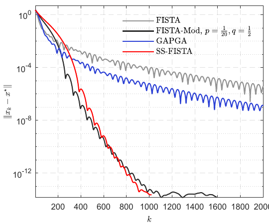
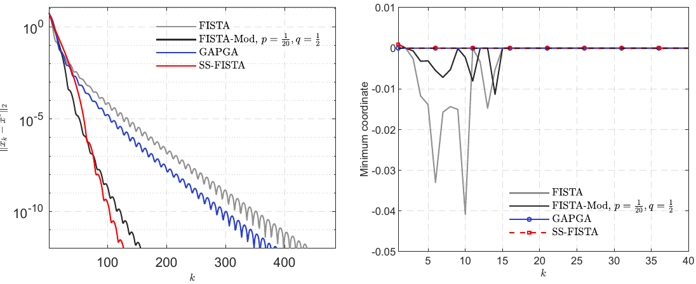

# SS-FISTA

MATLAB implementation accompanying the paper

**A Feasibility-Preserving FISTA Method for Composite Convex Learning Problems**

by Xiaowen Zhu, Xuanju Dang, Zhibin Zhu, Yuehong Ding, and Benxin Zhang.

## Overview

This repository provides MATLAB implementations of FISTA, FISTA-Mod,
GAPGA, and SS-FISTA for the numerical experiments considered in the paper.

The formal numerical experiments include:

1. Sparse Logistic Regression
2. Feasibility-Constrained Sparse Learning
3. Penalized Principal Component Pursuit

An additional linear inverse problem example is also included.

## Selected results

### Sparse Logistic Regression

### Feasibility-Constrained Sparse Learning

### Penalized Principal Component Pursuit

## Main scripts

- `main_sparse_logistic.m`
- `main_constrained_sparse.m`
- `main_pcp.m`
- `main_linear_inverse.m`

## Algorithms

- FISTA
- FISTA-Mod
- GAPGA
- SS-FISTA

## Requirements

- MATLAB R2022a
- MATLAB Wavelet Toolbox

## Data

The sparse logistic regression datasets used by the public scripts are
included under `data/logistic/`.

The repository includes `data/pcp/Lobby.mat`. The other PCP datasets used
in the paper are not included in this repository because of their large
file sizes. Researchers who need these additional datasets to reproduce
the corresponding experiments may contact the corresponding author using
the contact information provided in the paper.

## Acknowledgment of adapted experimental code

Parts of the experimental code for sparse logistic regression and
penalized principal component pursuit were adapted from the MATLAB
implementation accompanying:

J. Liang, T. Luo, and C.-B. Schönlieb,
“Improving ‘Fast Iterative Shrinkage-Thresholding Algorithm’:
Faster, Smarter and Greedier.”

Original implementation:
https://github.com/jliang993/Faster-FISTA

The corresponding experimental drivers and supporting routines in this
repository were subsequently modified to implement the algorithms,
parameter settings, preprocessing procedures, stopping criteria, and
evaluation protocol used in the present work. All numerical results
reported for the present work were generated using the current
implementation. The numerical results reported here are not taken from
the upstream repository.

See `THIRD_PARTY_NOTICES.md` for third-party notices.
